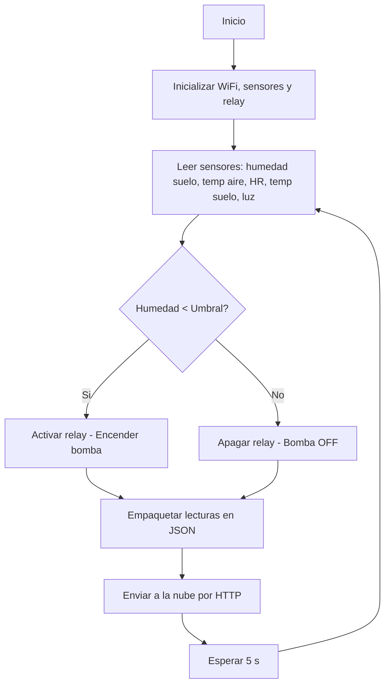

## Flujo de datos

```mermaid
flowchart TD
  A[Inicio] --> B[Inicializar WiFi, sensores y relay]
  B --> C[Leer sensores: humedad suelo, temp aire, HR, temp suelo, luz]
  C --> D{Humedad < Umbral?}
  D -->|Si| E[Activar relay - Encender bomba]
  D -->|No| F[Apagar relay - Bomba OFF]
  E --> G[Empaquetar lecturas en JSON]
  F --> G
  G --> H[Enviar a la nube por HTTP]
  H --> I[Esperar 5 s]
  I --> C
```
